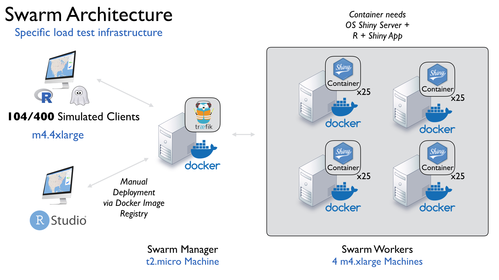
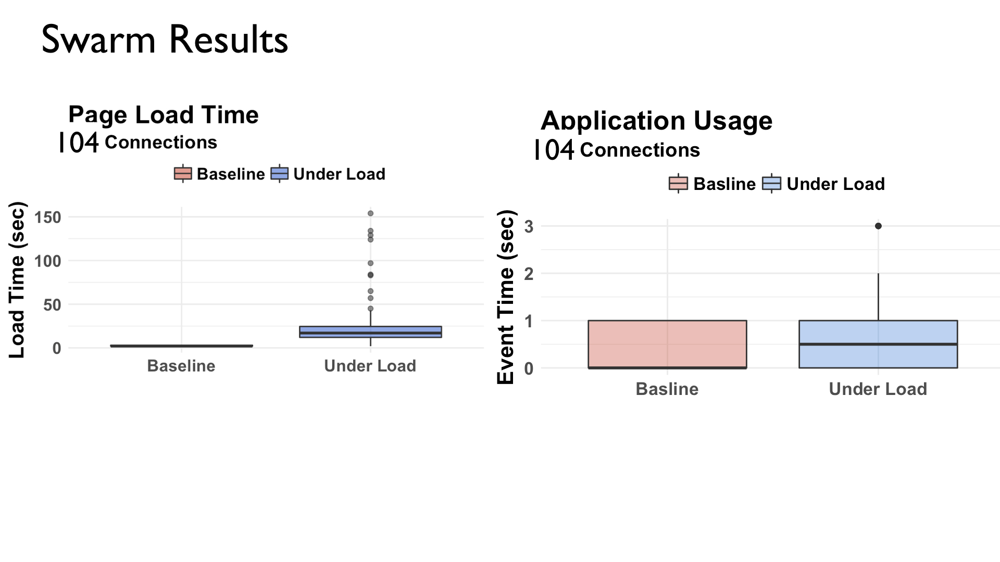
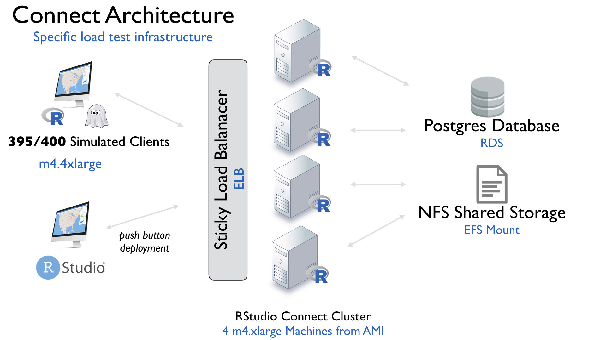
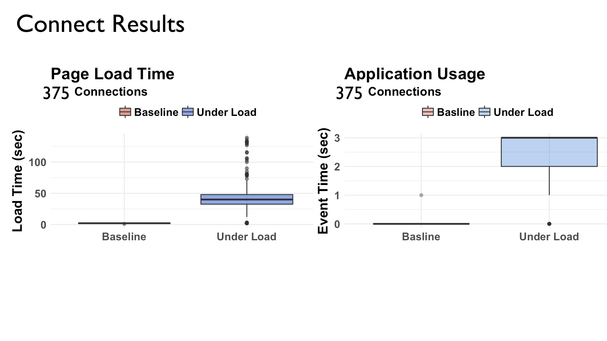

# Scaling Shing Applications for 1000s of Users

Shiny provides R users the ability to create web applications backed by R. These
applications can access complex statistical algorithms and orchestrate
computation in backends as diverse as C++, Tensorflow, and Spark. 

The primary concern when scaling Shiny applications is the performance of the
underlying R code. The Shiny framework itself scales horizontally like any
modern web application by adding backend processes. Unique to Shiny, these
processes run R. Communication between R and web clients is facilitated through
a special type of webserver. Two options for this webserver are the Open-Source
Shiny Server and the commercial product RStudio Connect. Other open-source and
commercial alternatives exist. 

## Benchmark Test

A performance benchmark was conducted on these two tools. The target was to
support 400 concurrent visits to a moderately complex shiny app.

Shiny relies on Javascript to respond to user interactions and communicate with
R as opposed to RESTful HTTP calls. This means standard load
testing frameworks like JMeter do not accurately simulate load. The load test
was conducted using the [shinyloadtest](https://rstudio.github.io/shinyloadtest) package. The package
simulates an end user visiting and interacting with an application using a
headless browser and records application latency for both page load and user
interactions. 

An m4.4xlarge node (64 cores total) was used to drive the 400 simultaneous
browsers used during the tests. The application code and test script are
available [here](https://github.com/slopp/Load-Test).

## Open Source Shiny Server and Docker Swarm

### Setup: 

- 4 m4.xlarge Worker Nodes (16 vCPU,  GiB RAM total)
- 1 t2.micro Manager Node (1 CPU, 2 GiB RAM)

A Dockerfile and [Image](https://hub.docker.com/r/slopp/sir_app/) were created that included R, the R packages required
by the application, and download, install, and configuration steps for Open
Source Shiny Server. Docker was installed on each node. A docker swarm was started on the manager
node. Each worker node was registered to the swarm.

In Open Source Shiny Server, each application is backed by 1 R process.
In order to scale an application, it is necessary to add additional instances of
Open Source Shiny Server, 1 for each desired R process. 

To support 400 concurrent users, I setup 100 containers running across the 4
worker nodes. This setup targets 4 connections per R process, which is a standard
concurrency rate for most Shiny apps. See [this article](http://shiny.rstudio.com/articles/scoping.html) to
understand how multiple connections can share a single R process. 

The final step is load balancing. In this setup, load balancing is tricky
because it is necessary to send requests across multiple machines and
multiple containers per machine while maintaining the sticky sessions
required by Shiny. To do so, a [Traefik load balancer](https://traefik.io/) was configured on the
manager node. Traefik is a unique load balancer capable of managing traffic *at
the Docker network layer* and has support for cookie-based sticky sessions.

A Docker compose YAML file was used to organize the Traefik load balancer and
the Docker images containing R, the app, and Shiny Server. Docker stack was used
to deploy across the swarm.

### Results

Of the 400 targetted concurrent connections, only **104 connections were
successful, with a peak of 94 concurrent connections**. The 104 connections ran with minimal latency compared to a baseline
test, but with significantly higher page load times.

Requests were successfully routed across the swarm and all
worker nodes hit 100% CPU utilization. The micro manager node serving the Traefik load balancer did not reach CPU or
memory thresholds.

The 296 failed connections all timed out, meaning the Shiny application did not
respond within the maximum page load time. Timeouts usually occur when
the R process assigned to a new connection is busy responding to existing shared connections and unable to accept the incoming initilization request.

One approach to solving this problem would be to add additional containers to
reduce the targetted number of connections per R process. However, all 4 machines were
maxed out on CPU supporting the 100 containers, so it is unlikely that adding more containers would have helped without adding additional worker nodes.

## RStudio Connect

### Setup:

- 4 m4.xlarge Nodes (16 cores, GiB total)
- 1 RDS Postgres DB
- 1 ELB
- 1 EFS Volume (NFSv4)

RStudio Connect is a commercial product designed to make it easy to publish and
deploy R-based content including Shiny applications.

In our setup, an AMI was created containing R and RStudio Connect. The AMI was
launched on the 4 nodes which were placed into an ELB target group. Sticky
sessions were enabled on the ELB. Each instance of Connect was configured to use
the RDS based Postgres DB and each node mounted the EFS share.

Deploying the application to the cluster was done through a single push-button
deployment step. Connect ensures package dependencies are resolved and deploys
the application automatically across the cluster.

After deploying the application, runtime settings were set in the Connect user
interface to start 80 R processes across the cluster. 

## Results

Of the 400 concurrent users, **375 had successful sessions with a peak of 343 concurrent connections**. Page load time was
higher than the baseline test, but the user interactions remained responsive.

During the load test all 4 nodes reach 100% CPU, so it is possible that adding a 5th node would have enabled 400 concurrent sessions.

## Key Takeaways

As a framework, Shiny has the capacity to scale horizontally. For a reasonably
complex app, 

> a 4
node, 16 core cluster was able to support 104 simultaneous users on an open-source
stack and 395 simultaneous users with RStudio Connect.

The main technical limitation in scaling open source shiny server was the
overhead in running shiny server and Docker for each additional R process. In contrast, RStudio Connect includes
the networking support to scale R processes directly.

Bigger than the technical limitation was the maintenance and setup overhead. The open source stack had a steeper learning curve and required the co-operation
of 4 open source tools: Traefik, Shiny Server, R, and Docker Swarm.
Changes to any of these tools would require developer maintenance time.
Connect's push-button deployment also enables a much faster development time compared to iteratations that required creating a
Docker image and manually identifying package
dependencies. 

> RStudio Connect's licensing cost should be weighed against the larger labor costs needed to maintain an open source stack..

